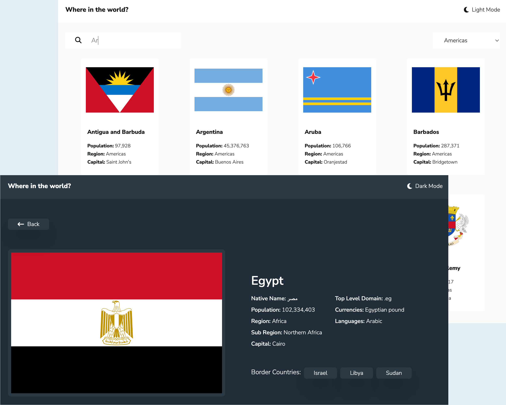

# Countries React App

-> <a href="https://sumedh-inamdar.github.io/countries-react-app/" target="_blank">link to page</a> <-

Multi-page application that shows different countries and their key data. User can navigate from home to individual country page, country to nearby country, search for countries, and filter by region.

Country data pulled from REST Countries API (https://restcountries.com/#api-endpoints-v2).

# Things to do

- [x] Mobile view for Homepage
- [x] Dark mode / Light mode
- [x] Semantic HTML tags
- [x] Remove button nested within Link
- [ ] Mock API call and check for proper rendering of country
- [ ] General code cleanup / organization

# Bugs to fix

- [x] Flag overflow issue on homepage
- [x] Misdirection to wrong country (e.g. India -> British Indian Ocean Territory)
- [x] Flag distortion on Card
- [ ] Align left and right cards on home to rest of page (may change to flex?)
